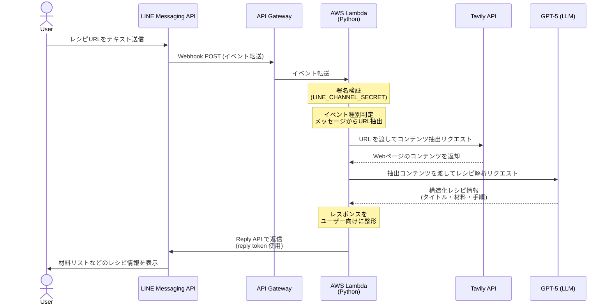

# RecipeBot
Send URL of recipe to LINE RecipeBot, then this bot analyzes its contents.

# プロダクト概要
- LINEに送られたメッセージを受け取り、生成AIで内容を解析し、有用な情報を返すボットである
- RecipeBotというLINEアカウントにwebhookが設定してある。このボットをLINEのグループチャットに追加した状態で他のユーザがレシピURLを送ると、RecipeBotがそのURLの内容を解析して返信する
- 解析の内容は、URLからレシピのタイトル、材料、手順を抽出し、ユーザが見やすい形で返す

# システム構成図
- システム間の情報の流れは`LINE Messaging API -> Webhook -> API Gateway -> AWS Lambda -> LLM / 外部 API -> LINE reply` である
- LLMはGPT-5を使用予定
- AWS LambdaはPythonランタイムで実装予定
- webhook経由で受け取ったレシピのURLはtavily APIを使って内容を抽出し、その後LLMで解析する

## シーケンス図（正常系）



# セットアップ
- LINE DevelopersでRecipeBot用のチャネルを作成し、Channel IDとChannel secretを取得する
- AWS lambda関数を作成し、取得したWebhoook URLをLINE Developersのチャネル設定に入力する

# デプロイ手順
- コードをリポジトリにプッシュする
- GitHub ActionsのCI/CDパイプラインの設定によりAWS S3にコードがアップロードされ、AWS Lambdaにデプロイされる

# 実行例
1. LINEのグループチャネルにURLをテキスト形式で送信する(例：https://www.kikkoman.co.jp/kikkoman/kaorishirodashi/dashimakinosubete/suzunarimurata/)
2. 以下のように材料が箇条書きで返信される
```
- 卵 / 3個​（L玉 180g）​
- キッコーマン 旨みひろがる香り白だし / 大さじ１​
- 水 / 90ml​
- 大根おろし / 適量
```

# 環境変数一覧
- `LINE_CHANNEL_SECRET`、`LINE_CHANNEL_ACCESS_TOKEN`、LLM用APIキー、Tavily APIキー、AWS関連設定などを列挙する
- 各変数の用途、必須か任意か、設定先を書く
- 開発環境と本番環境で値の扱いが異なるものがあれば書く

# 運用上の注意
- ログに個人情報や秘密情報を出さない方針とする
- 外部API障害時の挙動は未定、後日設定する
- 料金に影響するは未定、後日設定する

# 想定ユーザー / 利用シーン
- スマホのブラウザで作りたい料理のレシピを見つけた時、所定のグループラインにURLを送ると、材料がわかりやすく返信される

# 権限と外部依存

# 障害時の挙動
